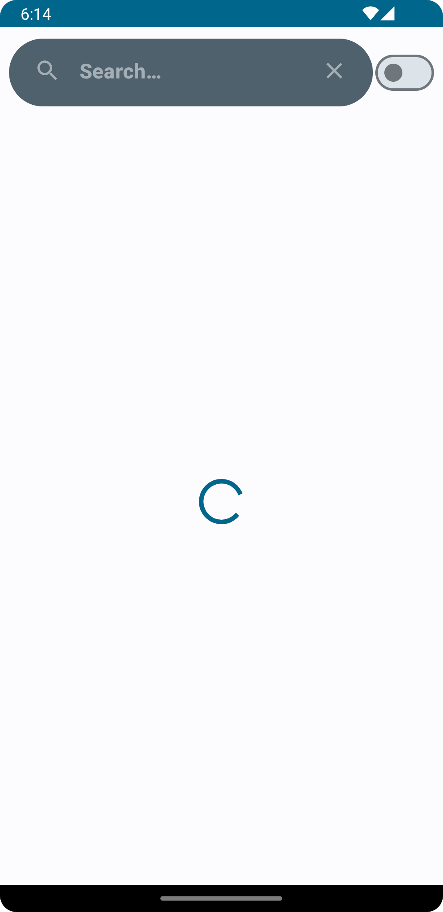
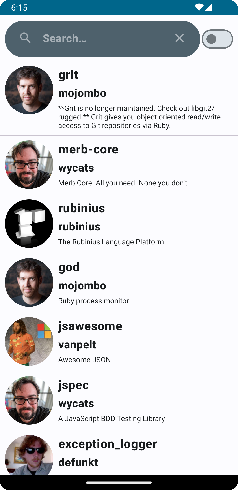
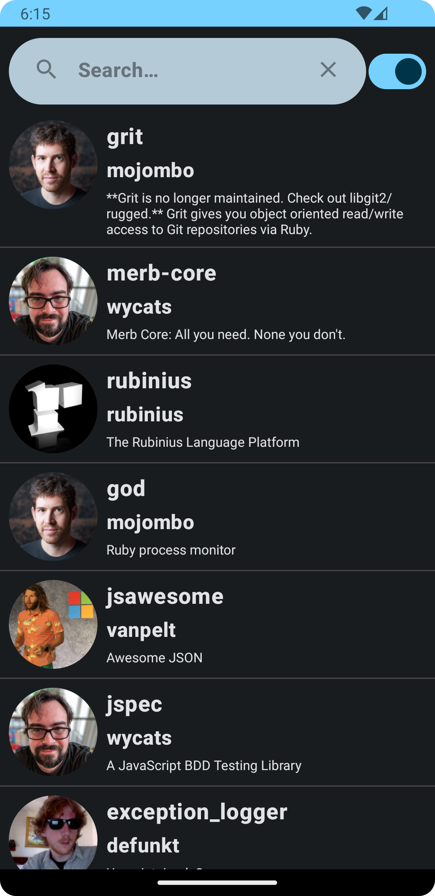
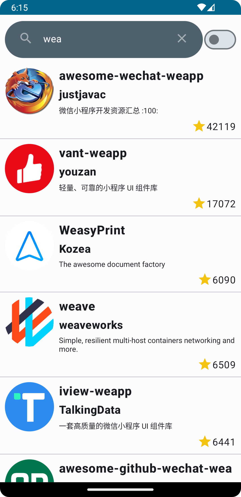
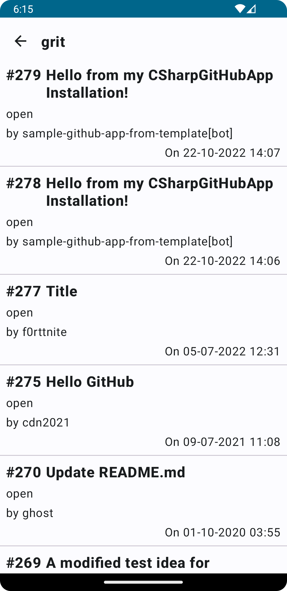
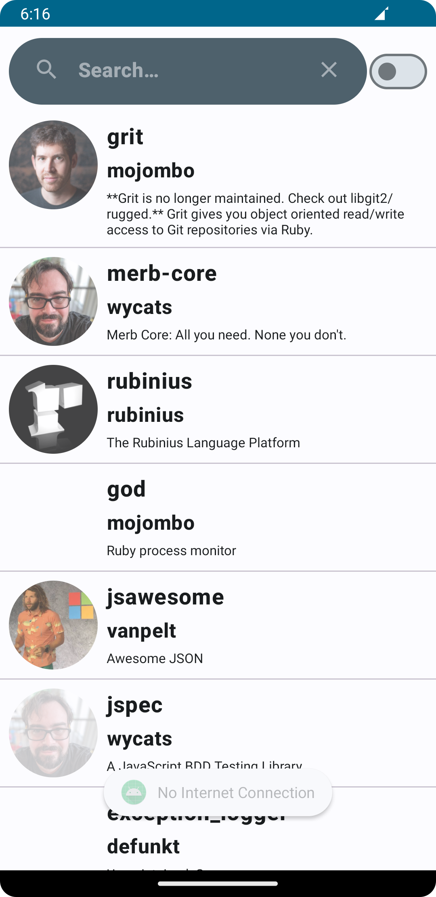

# GitHubRepo
 
 

An application for GitHub Repositories :

1- First screen is the main screen for repositories, has a list of repository item (title, author, avatar, description) with horizontal scroll view .

2- User can click on any item, then it'll redirect to the details screen.

3- User can see the details of choosen repository in the second screen (title,author,description,language,stars,rate,button to hit the issues list).

4- User can see the list of issues in the issue screen and each item has data about title, author,state and date of the issue.

5- User can search for any repository with specific title.

6- If the request is still being processed, user will see an animation for loading until it's done.

7- If there's error of no result, a message will be seen by user to infrom him that there's something abnormal.

8- If there's no internet connection, a toast will appear to user and will catch data from offline database.

9- User can change the theme of project between light and dark mode by a toggle button.

# Application architecture and structure

It is a single module project architecture. And, I'm following the Clean Architecture as a Software Architecture Pattern and MVVM as a Presentation Layer Pattern.

# Third-party used

1- Hilt : for dependency injection.

2- Coroutines : for handling the background operations.

3- Coil : for presenting images.

4- Retrofit : for making calls from API.

5- Room : for offline chaching.

6- Jetpack Compose : for creating UI.
